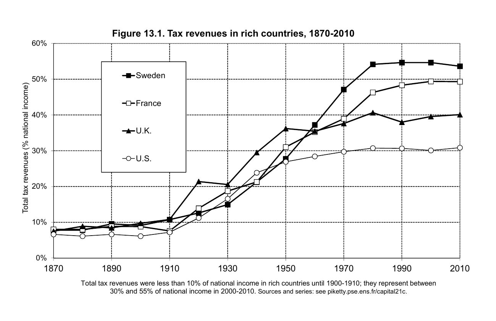
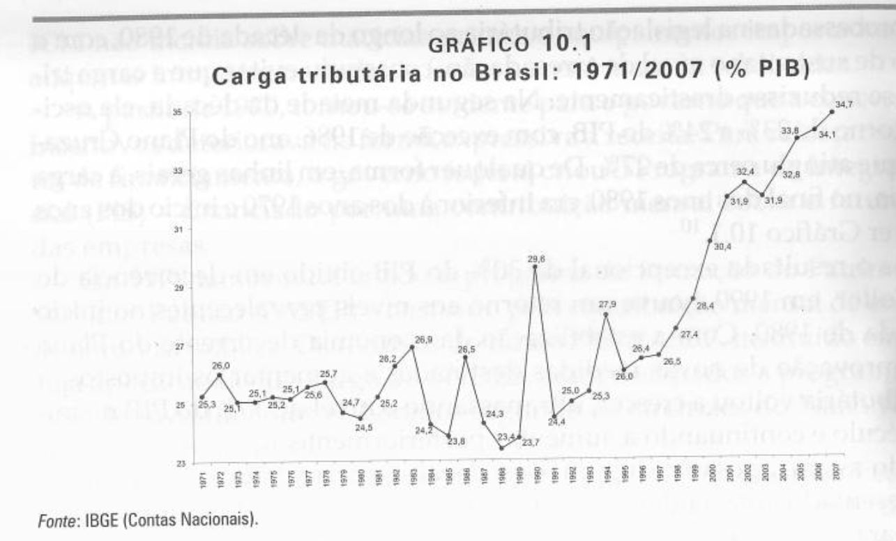
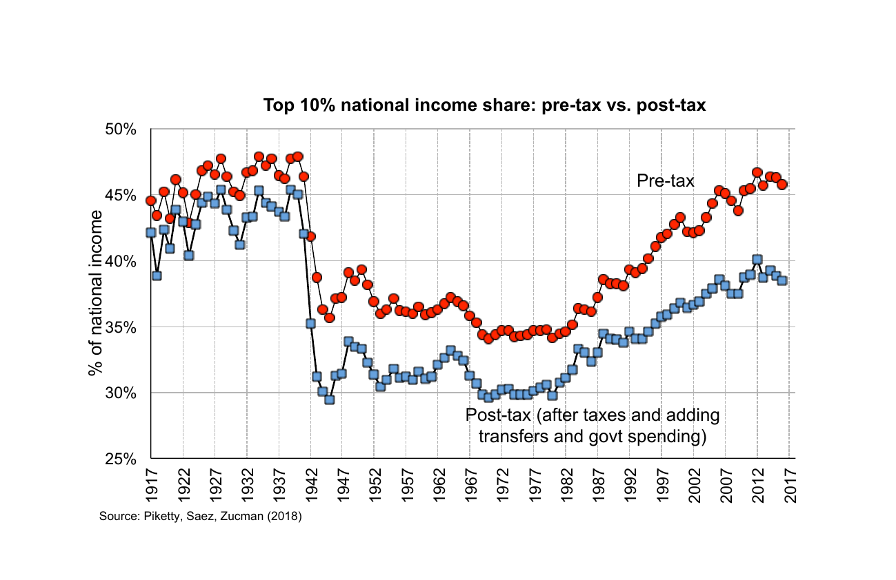
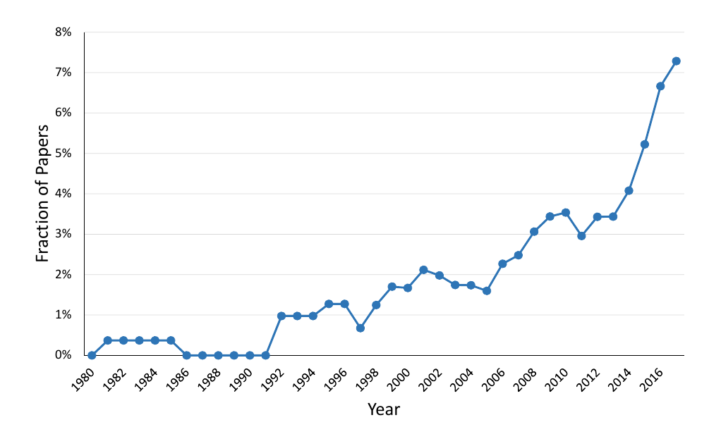
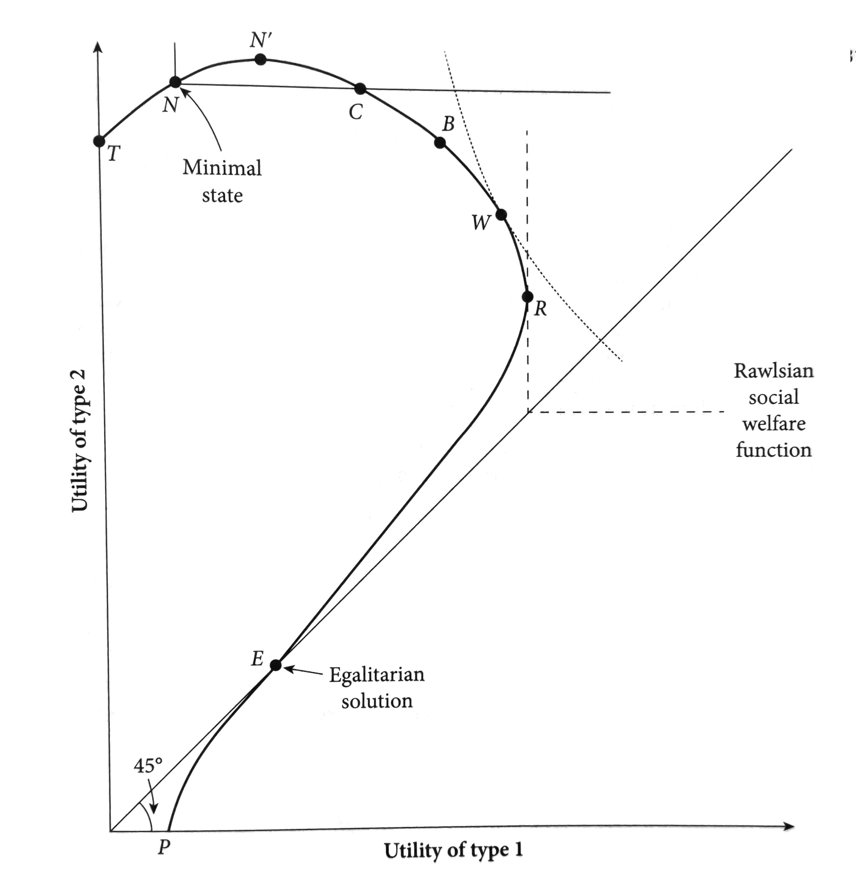
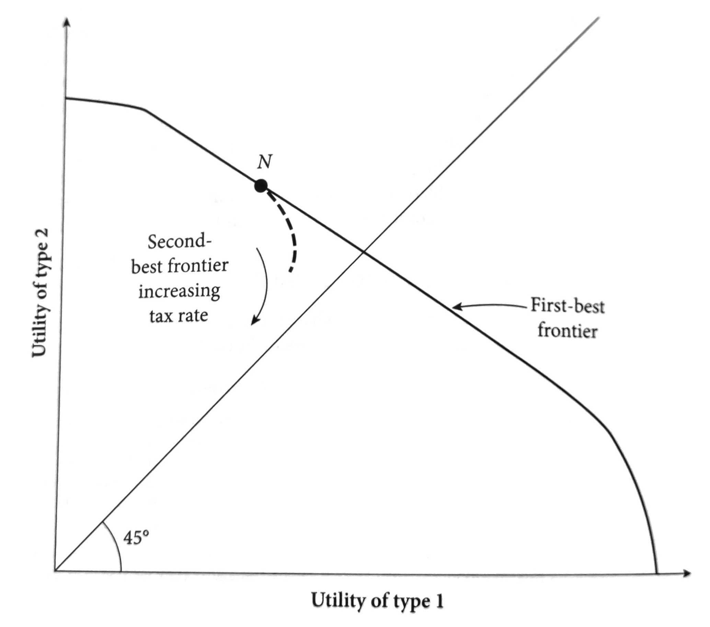

class: inverse, middle, center

```{r, load_refs, include=FALSE, cache=FALSE}
library(RefManageR)
BibOptions(check.entries = FALSE,
           bib.style = "alphabetic",
           cite.style = "alphabetic",
           style = "markdown",
           hyperlink = FALSE,
           dashed = FALSE)
myBib <- ReadBib("./eae6060_bib.bib", check = FALSE)
```

# Course logistics

---
class: middle
## Language

This course is offered in English. Classes and material are all in English

Students please feel free to ask questions or present papers in Portuguese

However, referee reports and replications are expected to be delivered in English


---
class: middle
## Grading

For successfull completion of the course Public Finance I, students need to deliver:

- 2 referee reports (10% of the grade each)
- 1 presentation (20% of the grade)
- 1 replication (40% of the grade)
- Participation in class (20% of the grade)

Public Finance II requirements are the same, but the replication can be a continuation of the one in Public Finance I

---
class: middle
## Referee reports

They are usually 1-2 pp. long, but here might should be longer (3 pp. is good):

1. One paragraph summarizing the article (for this course **one** page)
2. One paragraph with the *report*: the **main** reason why editor should accept, reject, or ask for revision
3. A section with **essential** criticisms and comments
4. A section with suggestions for the author that do not affect the decision

In previous iterations of this course, students tend to focus too much on *summarizing* the paper and too little on **refereeing** the paper &mdash; don't do that!

---
class: middle
## Paper replication

A paper from the syllabus or *elsewhere by instructor's discretion* &mdash; choose something that will be useful in your research (either the method or topic)

Get with authors or journal website data and code, and replicate with your own code the main tables. Add some robustness checks and extensions you find interesting

The product I expect is a 10 page text explaining *the replication* and *its result* (not to pretend you are writing the paper) and the code used 

---
class: middle
## Labpub

In FEA we have LabPub (Laboratório de Economia do Setor Público), a research group about public economics

Students interested in public finance and seeking to write dissertation or thesis in the topic should contact us. We also frequently open research positions for undergraduate and graduate students

The group is composed by Profa. Fabiana Rocha, Prof. Luis Meloni and myself

---
class: middle
## Undergraduate course

I also teach an undergraduate course in public economics at USP &mdash; slides are available online [here](https://www.pedroforquesato.com/pages/eae0310-2022.html)

I recommend following along the slides for that course as we go through topics here: there I have more time to cover more applied issues and the Brazilian public sector, while here we will take longer time on models and empirical papers

Feedback on the slides is appreciated

---
class: inverse, middle, center

# Introduction to public finance

---
class: middle
## Public finance

Public finance (or public economics) is the study of government economic activities 

Governments are a large part of modern economies: 

1. Most economic activities suffer some form of regulation, and many important industries are completely regulated (**IO**) 
2. Governments collect a large share of the national income as taxes (in some countries over 50%)
3. Government expenses are a significant part of domestic product
4. They have a large role in stabilizing business cycles (**macro**)

---
class: middle

```{r, echo=FALSE, out.width = '90%'}

```

Tax revenue as proportion of GDP for advanced economies, 1870-2010 (Piketty, 2018)

---
class: middle
```{r, echo=FALSE, out.width = '90%'}

```

Tax revenue as proportion of GDP for Brazil, 1970-2007 (Giambiagi & Além)

---
class: middle
## Modern view of government

Governments are formal institutions of social cooperation &mdash; even though markets can induce some forms of cooperation without explicit coordination, in some cases that is not enough

Public finance focus on situations when explicit coordination is necessary for desirable outcomes:

1. When the market coordination is flawed (e.g. internalities, externalities, public goods)
2. When the market mechanism generates more inequality than socially desirable

---
class: middle
```{r, echo=FALSE, out.width = '100%'}

```

---
class: middle
```{r, echo=FALSE, out.width = '80%'}

```

Fraction of papers mentioning "top 1%": the increase in inequality in the last few decades was accompanied by a growing interest in the topic within public finance research (Kleven, 2018)

---
class: middle
## Modern view of public finance

Public finance deals with two kinds of problems:

1. What are the effects of different public policies (**positive economics**)
2. What kind of public policies should be implemented by governments (**normative economics**)

Most of the course (empirical public finance) involves estimating the answers to questions of the first kind, but for real public policy *normative questions are unavoidable*

---
class: middle
## Modern view of public finance

Why study public finance?

> I admit to more than a scientific motivation; inteligent and civilized conduct of government and the delineation of its responsabilities are at the heart of democracy... [It] requires an understanding of the economic relations involved; and the economist, by aiding in this understanding, may hope to contribute to a better society

Richard A. Musgrave (1959), apud. Bozio (2019)

---
class: middle
```{r, echo=FALSE, out.width = '60%'}

```

When the society decides how to share utility (no Pareto improvements), different normative propositions imply different distributions of resources

---
class: middle
```{r, echo=FALSE, out.width = '60%'}

```

Importantly, alocations inside the Pareto frontier (**second-best**) might be more socially desirable than available Pareto optimal alocations &mdash; there is a role for ineficient taxation to improve welfare

