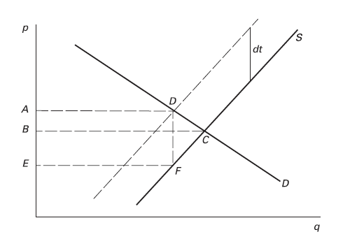
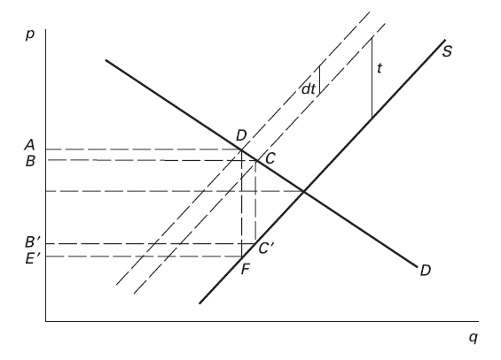
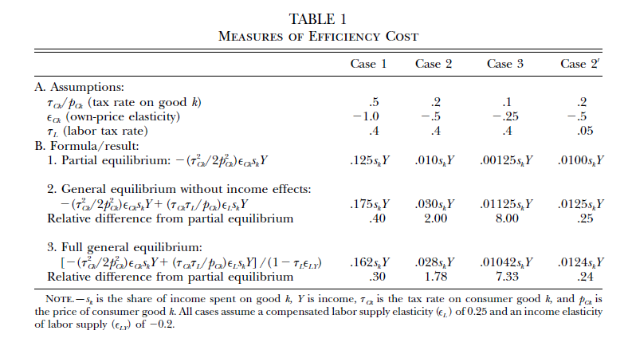
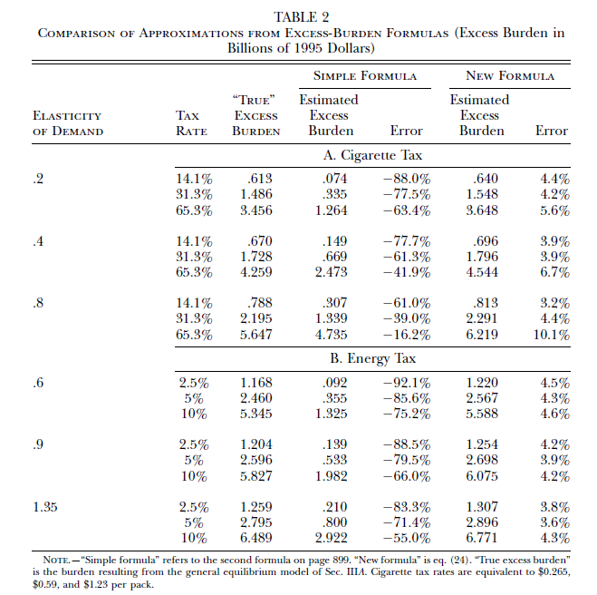
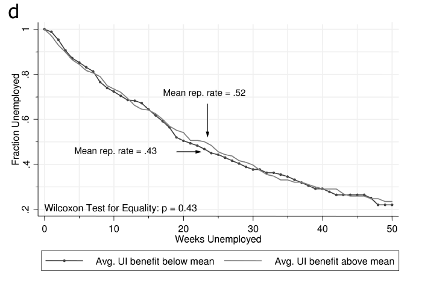
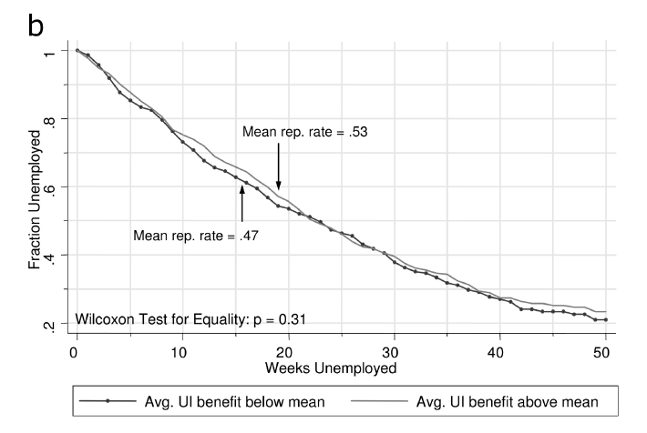
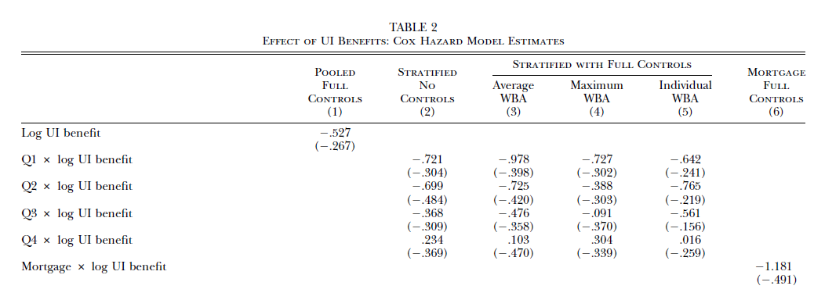
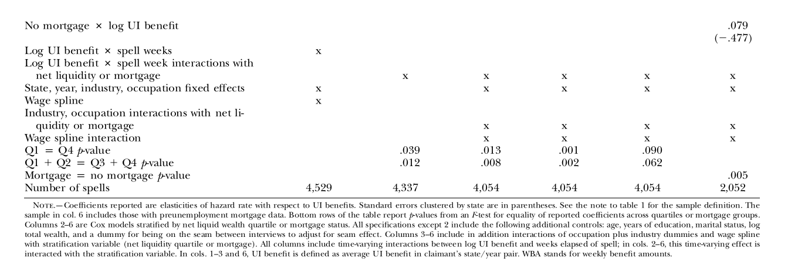
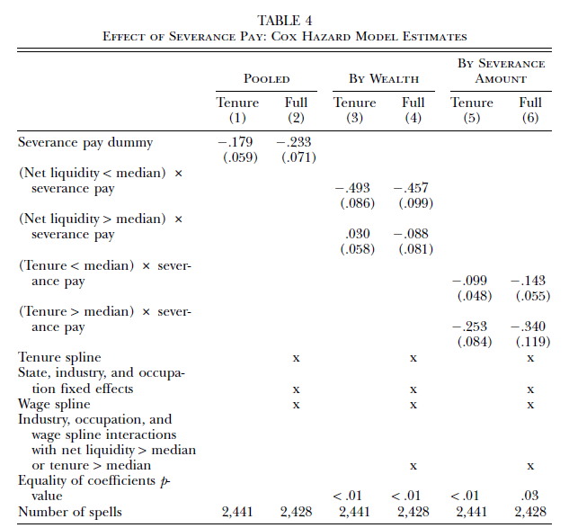

class: inverse, middle, center

```{r, load_refs, include=FALSE, cache=FALSE}
library(RefManageR)
BibOptions(check.entries = FALSE,
           bib.style = "alphabetic",
           cite.style = "alphabetic",
           style = "markdown",
           hyperlink = FALSE,
           dashed = FALSE)
myBib <- ReadBib("./eae6060_bib.bib", check = FALSE)
```

# Efficiency costs of taxation

---
class: middle
## Excess burden

Public economics studies how to best design public policy in order to minimize distortions while seeking social objectives

To provide public goods, redistribution, and other policies, governments must levy taxes &mdash; but since taxes alter the relative prices of different goods, they affect behavior

By altering behavior from what is efficient (in a first best scenario), taxes have *efficiency costs*, what economists call **excess burden**

---
class: middle
## Excess burden

We can measure in money-metric terms the change in well-being of a consumer with a price change (e.g., a tax) by the **equivalent variation**: $$EV = Y - e(p, V(p + dt, Y))$$

where $e(p, u)$ is the **expenditure function**, the necessary income $Y$ to reach a given indifference curve with utility $u$ at prices $p$ and $V$ is the indirect utility function

---
class: middle
## Excess burden

All price increases generate a loss of utility, but a tax generates an *excess* burden, because this loss of utility is excessive relative to the government revenue: $$EB = EV + \left( \sum_j \pi (p + dp) - \sum_j \pi (p) \right) - dt\cdot x(p + dt + dp, Y)$$

Transfering income between agents is costly: it is like using a bucket with holes to take water from a person to the next (*Okun's leaky bucket*) &mdash; our purpose here will be to empirically quantify the size of these leaks

---
class: middle
## Excess burden

Notice that only **substitution effect** generates deadweight loss: a *lump-sum tax* also has **income effect**, but it does not distort the economy

We can see that in the equation above since the equivalent variation is $Y - e(p, V(p, Y - T)) = T$, that is, the loss of welfare of the consumer is exactly equal to the government revenue (no *excess* burden)

Let's calculate excess burden in a partial equilibrium model with no income effects and representative consumer

---
class: middle

```{r, echo=FALSE, out.width = '60%', fig.align='center'}

```

An important fact about excess burden is that they are **second-order effects**, namely that $\lim_{dt \rightarrow 0} \text{EB}(dt)/dt = 0$: for small taxes (and *starting from a undistorted economy*), the deadweight loss is negligible in relation to the revenue `r Citep(myBib, "salanie2011economics")`

---
class: middle
## Harberger triangle

Dupuit in 1844 already knew we could measure the welfare cost of taxation by the area under the consumer demand (and above the producer suppy), i.e., the **surplus**

If the curves are linear we can measure excess burden exactly (and always approximately) by the area of the **Harberger triangle**

So if the base is $dt$ (D-F) and the height $-dx$ (C-(D-F)), the triangle area is $$EB = - \frac{1}{2} dx dt$$

---
class: middle
## Harberger triangle

But: $$dx = \frac{dx}{dp}\frac{dp}{dt}dt = \left( \frac{dx}{dp} \frac{p}{x}\right) \frac{x}{p} \left(\frac{\epsilon_D}{\epsilon_S - \epsilon_D}dt \right) dt,$$

where $dp/dt = \epsilon_D/(\epsilon_S - \epsilon_D) dt$ we will derive next week when talking about tax incidence, and we multiplied and divided by $x$ and $p$

$$\therefore EB = - \frac{1}{2} dx dt = - \frac{1}{2} \frac{\epsilon_D \epsilon_S}{\epsilon_S - \epsilon_D} \frac{x}{p} (dt)^2$$

---
class: middle
## Harberger triangle

The Harberger triangle formula gives us important intuitions about the excess burden of taxation:

(i) It *increases quadratically on $dt$*: this means that a large tax on one good is worse than smaller taxes on two goods &mdash; it also explains why governments should use debt to smooth tax burden across time

(ii) EB increases on the demand and supply elasticities: *taxing inelastic goods generates less excess burden*

---
class: middle

```{r, echo=FALSE, out.width = '60%', fig.align='center'}

```

When $t=0$, adding a tax $dt > 0$ generates small deadweight loss (*second-order*), but that is no longer valid if there is a pretax distortion in the economy (for example, $t>0$): the Harberger triangle becomes a trapezoid, with base proportional to $t + dt$, which does not disappear when $dt \rightarrow 0$ `r Citep(myBib, "salanie2011economics")`

---
class: inverse, middle, center

# Goulder e Williams (2003). "The substantial bias from ignoring general equilibrium effects in estimating excess burden, and a practical solution"

---
class: middle
## Harberger triangle formula

We can directly estimate real world deadweight losses by estimating the relevant elasticities and plugging in the formula (as Harberger did)

But a big limitation is that it assumes only *partial equilibrium* &mdash; the general equilibrium formula is more complicated: $$EB = - \frac{1}{2} \tau^{2}_{k} \frac{dX_k}{d \tau_k} - \sum_{i \neq k} \tau_i \tau_k \frac{d X_i}{d \tau_k}$$

That formula, however, envolves calculating all $i\times k$ cross-derivatives $d X_i / d \tau_k$, which is impractical

---
class: middle
## Labor supply effects

`r Citep(myBib, "goulder2003substantial")` calibrates a GE model and compares the formula results with "real" (full model) values, with and without cross-derivatives &mdash; they find that in some cases the difference is small, but up to 10x bigger

Their main insight is that we can approximate well the **general equilibrium excess burden** considering only cross-elasticity with *labor supply*

This is intuitive &mdash; a common pattern in this course will be that the main source of inefficiency in taxation is distorting (reducing) labor supply

---
class: middle
## "Labor supply-augmented" formula

First we differentiate the (representative consumer) utility by tax to good $k$:

$$\frac{1}{\lambda} \frac{dU}{d \tau_{Ck}} = \frac{\tau_{Ck} C_k}{p_{Ck}} \epsilon_{Ck} - \frac{\tau_L L}{p_{Ck}} \epsilon_L s_k (\theta + 1),$$

$$\text{where } \theta \equiv \frac{\epsilon_{C_k L}}{\sum_{i=1}^M s_i \epsilon_{C_i L} }$$ 
measures how substitute to leisure is good $k$ (relative to the average)

Here we approximate the (correct) **compensated demand** by the Marshallian demand, which will be a good approximation when *income effects* are small

---
class: middle
## "Labor supply-augmented" formula

Note what we saw before: the *own-effect* part of EB is *second-order* to $\tau_{Ck}$, going to zero when tax is small (this formula is for marginal taxes), but the *cross-effect* part depends on $\tau_L$ and is *first-order*

In order to measure welfare changes, we need to integrate it to a non-marginal tax &mdash; we can approximate the integral by the **trapezoidal rule**, obtaining the *labor-supply augmented Harberger triangle*

$$\frac{1}{\lambda} \Delta U = s_k Y \left[ \frac{\tau_{Ck}^{2}}{2 p_{Ck}^{2}} \epsilon_{Ck} - \frac{\tau_{Ck} \tau_L}{p_{Ck}} \epsilon_L (\theta + 1) \right]$$

---
class: middle

```{r, echo=FALSE, out.width = '80%', fig.align='center'}

```

When own-price elasticity and tax rate on good $k$ are small and labor taxation $\tau_L$ is high, the simple Harberger formula can substantially understate excess burden: most deadweight loss comes not from less consumption of good $k$, but *lower labor supply* &mdash; usually, EB is about 3% of the market size `r Citep(myBib, "goulder2003substantial")`

---
class: middle
## Taxation and labor supply

Note that income effects **reduce** excess burden, since taxation make people poorer, and they work more (since leisure is a normal good), which reduces *under-supply of labor*

This paper is interesting not only for giving a more precise formula for excess burden, but it underlines an important point in theory of taxation: in an economy with taxation, *labor is always under-supplied*

Any policy that subsidises labor supply will generally increase economic efficiency

---
class: middle
## Simulation

The last table was a simple comparison of formulas, given some estimates for the parameters &mdash; the authors also calibrate a GE modelo with data from Survey of Current Business, in USA

They estimate using this calibrated model the **excess burden** of a rise in cigarette and energy taxation, given a range of estimated elasticities of demand &mdash; taxes on cigarettes vary from 15-65%, while taxes on energy are much smaller at about 5%

They then compare the "true" EB calculated with the full model with the approximated EB calculated from the simple formulas

---
class: middle

```{r, echo=FALSE, out.width = '60%', fig.align='center'}

```

In these "real world" examples, Harberger triangle formula can understate excess burden by one order of magnitude, while the formula with labor supply generates very good approximations `r Citep(myBib, "goulder2003substantial")`

---
class: inverse, middle, center

# Chetty (2008). "Moral hazard versus liquidity and optimal unemployment insurance"

---
class: middle
## Sufficient statistics

A large component of modern public finance (and this course) is the **sufficient statistics approach** for welfare analysis `r Citep(myBib, "chetty2009sufficient")`

This approach was popularized by Raj Chetty and others in the 2000s, but we have seen a direct use of this method in `r Citep(myBib, "goulder2003substantial")`, and even the Harberger triangle is an application of sufficient statistics

The idea is to use a model of individual utility (or a social welfare function) and the **envelop theorem** to solve for simple formulas of welfare effects of policies that depend on just a couple of *sufficient stastitics*

---
class: middle
## Sufficient statistics

Chetty defended this approach by being more robust, since you do not need a fully specified utility function, but that has since been questioned `r Citep(myBib, "kleven2021sufficient")`

It does, however, have the advantages of being simpler and easier to combine with quasiexperimental methods &mdash; this last advantage, in particular, probably explains its enormous rise in popularity in recent decades

Although off-topic, this paper on optimal unemployment insurance is one of the earliest and most famous applications of the approach (and a seminal paper on its own right)

---
class: middle
## Optimal unemployment insurance

It is a (not surprising) empirical fact that unemployment insurance lengthens unemployment duration: a 10% rise in the benefit raises it by 4-8% 

Generally that was seen as **moral hazard** issue, which should lower optimal insurance &mdash; but what if this is a liquidity effect for credit constrains?

`r Citep(myBib, "chetty2008moral")` creates a sufficient statistics formula for optimal unemployment insurance that *marginally* equates **consumption smoothing** (good) with moral hazard (bad), and tries to estimate empirically the size of each effect

---
class: middle
## Job search problem

Consider the **value function** of an employed worker at time $t$ with wealth (assets)  $A_t$, $V_t$, and their value function when unemployed $U_t$, given by: $$V_t(A_t) = \max_{A_{t+1} \geq L} v_t (A_t - A_{t+1} + w_t - \tau) + V_{t+1}(A_{t+1})$$ $$U_t(A_t) = \max_{A_{t+1} \geq L} u_t (A_t - A_{t+1} + b_t) + U_{t+1}(A_{t+1})$$ 

The agent then chooses a **job search effort** $s_t$ with cost $\psi (s_t)$ to solve his job search problem: $$J_t (A_t) = \max_{s_t} s_t V_t(A_t) + (1 - s_t) U_t (A_t) - \psi (s_t)$$

---
class: middle
## Job search problem

This gives us a *first order condition* of job search intensity: $$\psi^{\prime} (s_t) = V_t (A_t) - U_t (A_t)$$

Differentiating the FOC with regards to $w_t$, $A_t$, and $b_t$ we have:

$$\psi^{\prime \prime}(s_t)\frac{ds_t}{dw_t} = v^{\prime}(c_t^e) \Rightarrow \frac{ds_t}{dw_t} = \frac{v^{\prime}(c_t^e)}{\psi^{\prime \prime}(s_t)}\text{ (1)}$$
$$\psi^{\prime \prime}(s_t)\frac{ds_t}{dA_t} = v^{\prime}(c_t^e) - u^{\prime}(c_t^u) \Rightarrow \frac{ds_t}{dA_t} = \frac{v^{\prime}(c_t^e)-u^{\prime}(c_t^u)}{\psi^{\prime \prime}(s_t)}\text{ (2)}$$
$$\psi^{\prime \prime}(s_t)\frac{ds_t}{db_t} = - u^{\prime}(c_t^u) \Rightarrow \frac{ds_t}{db_t} = \frac{-u^{\prime}(c_t^u)}{\psi^{\prime \prime}(s_t)}\text{ (3)}$$

---
class: middle
## Unemployment insurance

But note that $\text{(2)} = \text{(1)} + \text{(3)}$, which leads to: $$\frac{\partial s_t}{\partial b_t} = \frac{\partial s_t}{\partial A_t} - \frac{\partial s_t}{\partial w_t}$$

This result is useful, but also intuitive! A rise in unemployment insurance benefits $b_t$ has two effects: a **substitution effect**, lowering *relative* wages, and an **income effect**, as it effectively raises worker life-cycle wealth

Both effects *lower* job search, but the substitution effect is undesirable (moral hazard), while the income effect is desirable (consumption smoothing, solving a market failure)

---
class: middle
## Unemployment insurance

Imagine a single period: the optimal insurance is the one that maximizes agent utility $J (A)$ given a **budget neutral** policy $(1 - s)b = s\tau$

$$ \max_{b} W(b) = (1 - s) u(A + b) + s v\left(A + w - \tau\right) - \psi(s)$$
Using the **envelop theorem**, we can disregard the effect of $b$ on the maximand $s$ &mdash; we need to only consider the **fiscal externality** on taxes: $$\frac{dW}{db}(b) = (1-s)u^{\prime}(c^u) - sv^{\prime}(c^e)\frac{d\tau}{db}\text{, where }\frac{d\tau}{db} = \frac{1 - s}{s} - \frac{b \cdot ds/db}{s^2}$$

---
class: middle
## Unemployment insurance

Which gives us the *optimality condition* for the unemployment insurance: $$\frac{u^{\prime} (c_0^u) - v^{\prime} (c_0^e)}{v^{\prime} (c_0^e)} = \frac{\epsilon_{1-s,b}}{s}$$

At the optimal level, the *marginal benefit* of unemployment insurance (consumption smoothing) must equal the *marginal cost*: moral hazard, captured by the elasticity of unemployment w.r.t. benefit $\epsilon_{1-s,b}$

In particular, if we disregard the role of consumption smoothing (or if insurance markets are perfect), then unemployment insurance is *always* bad

---
class: middle
## Empirical strategy

Two different strategies: 

1. Compare unemployment duration between wealthy (no need for consumption smoothing) and not wealthy, with high or low unemployment benefits

2. Estimate $\partial s_t/\partial A_t$ by investigating the response of Mathematica employees that received severance packages

They find that 60% of effect of unemployment benefits comes from consumption smoothing, which leads to an optimal unemployment benefit higher than 50% of salary

---
class: middle

```{r, echo=FALSE, out.width = '75%', fig.align='center'}
knitr::include_graphics("figs/aula-3-grafico-5.png")
```

For the *lowest quartile in wealth*, having an above average unemployment insurance leads to significantly longer unemployment durations than lower than average benefits

---
class: middle

```{r, echo=FALSE, out.width = '75%', fig.align='center'}

```

But for the *upper quartile in wealth*, there is no significant difference between low and high benefit on unemployment duration: most of the effect of UI seems to come from **consumption smoothing** 

---
class: middle

```{r, echo=FALSE, out.width = '75%', fig.align='center'}
knitr::include_graphics("figs/aula-3-grafico-7.png")
```

They find the same pattern with *mortgaged houses*: those that have mortgages (low wealth) see a large effect of UI benefit...

---
class: middle

```{r, echo=FALSE, out.width = '75%', fig.align='center'}

```

... while those that have not mortgaged houses (high wealth) see no effect

---
class: middle
## Hazard models

Chetty estimates linear hazard (duration) models by OLS on the probability of being hired from unemployment, with errors clustered by state: $$\log h_{i,t} = \alpha_t + \beta_1 \log b_i + \beta_2 t \times \log b_i + \beta_3 X_{i,t}$$

Since the regression is log-log, the coefficient $\beta_1$ identifies the elasticity of $h$ (i.e., $1-s$) w.r.t. $b_i$: $\epsilon_{D_B,b} \approx \epsilon_{1-s,b}$, one of the sufficient statistics

They also interact $b_i$ with aforementioned measures of wealth, to disentangle $\partial s_t/\partial w_t$ from $\partial s_t/\partial A_t$

---
class: middle
## Identification hypothesis

What is the identification hypothesis for this model?

--

It is a simple OLS regression: we need that conditional on covariates $X_{i,t}$ and conditional on time trends interacted with benefits, the level of benefits *and wealth* are unrelated to unobservables that affect probability of finding employment

---
class: middle

```{r, echo=FALSE, out.width = '100%'}

```
```{r, echo=FALSE, out.width = '100%'}

```

---
class: middle

```{r, echo=FALSE, out.width = '80%', fig.align='center'}
knitr::include_graphics("figs/aula-3-grafico-10.png")
```

Similarly, they find that unemployed workers that receive severance payment (able to smooth consumption, but no incentive effect) take longer to get back to working force than those that did not receive it

---
class: middle

```{r, echo=FALSE, out.width = '65%', fig.align='center'}

```

Severance pay $A$ increases unemployment duration, but only for low liquidity households (unable to smooth consumption)

---
class: middle
## Welfare calibration

The advantage of the **sufficient statistics** approach is that it allows one to "plug in" causal estimates of the statistics of interest directly on the optimal policy formula

We can use the elasticities calculated empirically to *calibrate* the welfare effect of unemployment insurance

If $h$ is the hazard rate, $\bar{b}$ is the mean benefit value, $B$ the (maximum) duration, and $\bar{S}$ the mean severance value, the proportional search effect of severance and benefits is: $$\left. \frac{\partial s}{\partial a} \right|_{B} / \frac{\partial s}{\partial b} = \frac{B\bar{b}}{\bar{S}} \frac{(h_s - h_0)/h_0}{(h_b - h_0)/h_0}$$


---
class: middle
## Liquidity and moral hazard effects

By Table 2 (column 1), the hazard effect of unemployment benefits is $-0.527$ and therefore $h_b/h_0 = e^{-0.53}$ &mdash; by Table 4 (column 2), the effect of severance payment on unemployment hazard is  $-0.233 \Rightarrow h_s/h_0 = e^{-0.23}$

Plugging all in the equation of previous slide, and noting that $\bar{S}=21.4\bar{b}$ and $B = 26$, we get that liquidity effect is 60% of total effect of unemployment insurance! $$ \left. \frac{\partial s}{\partial a} \right|_{B} / \frac{\partial s}{\partial b} = \frac{26}{21.4} \frac{e^{-0.23} - 1}{e^{-0.53} - 1} =  60\%$$

---
class: middle
## Welfare calibration

Finally, we calibrate all statistics on the *optimal unemployment insurance* formula: unemployment rate $\sigma = 0.946$; elasticity of unemployment duration regarding benefits $\epsilon_{D_B,b} = 0.53$; unemployment duration $D = 1/h$ and benefit duration $D_B$; and $60\%$ liquidity share of effect of unemployment insurance

$$\frac{dW}{db} (b = 0.5w) = \frac{1 - \sigma}{\sigma} \frac{D_B}{D} \frac{\partial s}{\partial a} / (\frac{\partial s}{\partial a} - \frac{\partial s}{\partial b}) - \frac{\epsilon_{D_B,b}}{\sigma}$$

$$= \frac{1 - 0.946}{0.946} \frac{15.8}{24.3} \left( \frac{0.6}{0.4} - \frac{0.53}{0.946} \right) = 0.04$$

---
class: middle
## Welfare calibration

At 50% replacement rate (USA current levels), the derivative of welfare w.r.t. unemployment benefits is slightly positive, denoting that increasing replacement rate increases welfare

This happens because a large part of unemployment insurance effect comes from **consumption smoothing**, which increases welfare, as opposed to *moral hazard*, that decreases it

Note that since all elasticities are calculated at current benefit levels, we cannot directly calibrate the welfare equation to find the *optimal replacement rate* without further assumptions &mdash; this is the topic of the next paper

---
class: inverse, middle, center

# Kleven (2021). "Sufficient statistics revisited"

---
class: middle
## Sufficient statistics

In the 12 years between Chetty's paper we just saw and this one, the **sufficient statistics** approach became dominant in public economics

One motivation for its use that was frequently put forward by its proponents was that it needs *less assumptions* then estimating full behavioral models, since you don't need to specify utility functions &mdash; Kleven discusses this, focusing on 3 classes of assumptions of the sufficient statistics approach:

1. Infinitesimal changes;
2. No other types of distortions;
3. Restrictions on the decision structure and preferences

---
class: middle
## Sufficient statistics

In this paper, Kleven gives general formulas robust to revoking all 3 assumptions &mdash; but while the formulas are (more or less) tractable, they require estimating more and more convoluted *sufficient statistics*

Therefore, while the approach does not require heavy assumptions, its pratical application does &mdash; while *in principle* more general, in practice the sufficient statistics approach is as **structural** as estimating full models

The benefit of this approach remains to be that it is much simpler, as it does not involve tough programming and computation of the estimation of structural parameters in potentially complex choice models

---
class: middle
## Model

Consider a general utility function $u^{i} (x^i_0 , ..., x^i_J ) = u^i (\mathbf{x^i})$ where $\mathbf{x^i}$ is a vector of pre-tax expenses (with price normalized to 1). Given a piecewise-linear function of taxes paid $T$, the budget constraint is: $$\sum_{j=0}^{J} x_j^i + T(x_0^i , ..., x_J^i ) = y^i \Rightarrow \sum_{j=0}^{J} (1 + \tau_{j}^{i}) x_j^i = Y^i$$
Where $Y^i \equiv y^i + \sum_{j=0}^{J} \tau_j^i (\theta) x_j^i - T(x_0^i , ..., x_J^i )$ is the *virtual income* &mdash; this gives us the *first order conditions* of individual optimization:

 $$\text{[FOC:] } \frac{\partial u^i}{\partial x^i_j} - \lambda^i (1 + \tau^i_j) = 0$$

---
class: middle
## Envelope theorem

The FOC conditions give us $k$ **marshallian demands** $x^i_k (\mathbf{1 + \tau^i}, Y^i )$ and an **indirect utility function** $v^i (\mathbf{1 + \tau^i}, Y^i)$

By the **envelope theorem** they satisfy $\partial v^{i} / \partial Y^i = \lambda^i$ and (Roy identity): $\partial v^i / \partial (1 + \tau_k^i) = - \lambda^i x_k^i$ &mdash; thus, for an infinitesimal policy change $d \theta \approx 0$: 

$$\frac{dv^i}{d\theta} = \sum_{j} \frac{dv^i}{d(1 + \tau_j)} \frac{d\tau_j^i}{d\theta} + \frac{dv^i}{dY^i} \frac{dY^i}{d\theta}$$


$$\frac{dv^i / d\theta}{\lambda^i} = - \sum_{j=0}^{J} x_j^i \frac{d \tau_j^i}{d\theta} + \frac{d Y^i}{d\theta}$$


---
class: middle
## Welfare effects of a policy change

But the virtual income is given by $Y^i \equiv y^i + \sum_{j=0}^{J} \tau_j^i (\theta) x_j^i - T(x_0^i , ..., x_J^i )$ &mdash; differentiating in $\theta$, we get: $$\frac{d Y^i}{d\theta} = \sum_{j=0}^{J} \frac{d \tau_j^i}{d\theta} x_j^i - \frac{\partial T^i}{\partial \theta}$$


From the *envelope theorem* and the assumption of no other distortions we can arrive at the **money-metric effect on utility** of the policy reform

$$\frac{dv^i / d\theta}{\lambda^i} = - \frac{\partial T^i}{\partial \theta}$$

---
class: middle
## Social welfare

Therefore, the welfare effect of a policy change is, *to a first order approximation*, equal to its **mechanical** effect on the government budget

Note that the welfare to individual of a rise in government revenue is always negative: so far we assumed the revenue is "thrown away" &mdash; let's rather assume it has a social benefit $\mu$

Then we can see the effect of policy change $\theta$ on *social* welfare by aggregating individual effects using *Pareto weights* $\omega^i$:  $$W (\theta) = \int_{i} \omega^i v^i (\theta) di + \mu \int_i T^{i} (\theta) di$$


---
class: middle
## Social welfare

$$\frac{d W / d\theta}{\mu} = \int_i \left[ \left( \frac{dT^i}{d\theta} - \frac{\partial T^i}{\partial \theta} \right) + (1 - g^i) \frac{\partial T^i}{\partial \theta} \right] di,$$

where $g^i \equiv \omega^i \lambda^i / \mu$ is the **social welfare weight** of individual $i$ &mdash; Since when talking about *deadweight loss* we care about efficiency, not equity, we can assume $g^i \equiv 1$ and therefore the effect of a marginal policy change is:

$$\left. \frac{d W / d\theta}{\mu} \right|_{g^i = 0} = \int_i \left[ \frac{dT^i}{d\theta} - \frac{\partial T^i}{\partial \theta} \right] di,$$ 

To a first order approximation, the welfare effect of a tax is the **total** revenue change minus the *mechanical effect*: that is, the **behavioral effect** of the policy 

---
class: middle
## Social welfare

Naturally, since we assumed that cash is taxed (at a cost) and then redistributed back to individuals, if there are no redistributive goals, optimal tax would be zero

Since at the optimum the "derivative of choice variable is zero", taxation has no *first-order* effect on utility through a change of behavior (say labor supply) &mdash; the only effect is a **fiscal externality**, since individuals consume less of taxed goods and that results in less govt revenue

Note that for *a given policy*, we can estimate the equation above directly on data (but we need more structure for external validity):  $$\mathbb{E} \left[ T (x_0^i (\mathbf{x^i} (\theta_1)), \theta_1)) \right] - \mathbb{E} \left[ T (x_0^i (\mathbf{x^i} (\theta_0)), \theta_1)) \right]$$

---
class: middle
## Sufficient statistics

Substituting $T(\mathbf{x^i}) = \sum_{j=0}^{J} \tau_j^i x_j^i$ and differentiating, we get: $$\left. \frac{d W / d\theta}{\mu} \right|_{g^i = 0} = \int_i \sum_{j=0}^{J} \left[ \sum_{k=0}^{J} \tau_{j}^{i} x_{j}^{i} \epsilon_{jk}^{i} \frac{d\tau^i_{kj}/d\theta}{1 + \tau_{ki}} - \tau_j^i x_j^i \eta_j^i \frac{\partial T^i / \partial \theta}{y^i}  \right] di,$$

where $\epsilon_{jk}^i$ is the compensated elasticity of $j$ in relation to $k$, and $\eta_j^i$ the income effect on good $j$: these are **sufficient statistics** for the *general equilibrium* welfare effect of a tax &mdash; but GE involves estimating $(J + 1) \times J$ parameters

---
class: middle
## Tractable formulas

To get more practical formulas, we can assume: (i) quasilinear utility (no income effect), (ii) only one good is taxed (or no cross-elasticities); and (iii) linear taxes &mdash; then we get: $$\left. \frac{d W / d\theta}{\mu} \right|_{g^i = 0} = \bar{\epsilon_0} \cdot \frac{\tau_0}{1 + \tau_0} \cdot \frac{d \tau_0}{d\theta},$$

which is a Harberger-like formula with a single elasticity $\bar{\epsilon_0}$ (sufficient statistic) for taxed good $0$ &mdash; *fundamental problem:* the general formula has too many parameters to estimate; microeconomic assumptions can make analysis empirical feasible, but these assumptions make it "more structural"

---
class: middle
## Large reforms

So far we looked at infinitesimal changes, but in the real world policy changes are "large": if $\theta = 0$ is the pre-reform and $\theta = 1$ post-reform, then we are interested in $\Delta W(\theta) = W(1) - W(0) = \int_0^1 \frac{dW}{d\theta} d\theta$

Given the assumptions of the previous slide, we can use a *trapezoidal approximation* of the integral: $$\left. \frac{\Delta W}{\mu} \right|_{g^i = 1} \approx \bar{\epsilon_0} \left\{ \frac{\tau_0}{1 + \tau_0} + \frac{1}{2} \Delta \left[ \frac{\tau_0}{1 + \tau_0} \right] \right\} \cdot \Delta \tau_0$$

In the general case we would need to estimate as well how the elasticity varies as the policy is implementated, namely $\Delta \bar{\epsilon}$, but that is in practice generally unfeasible &mdash; above we assume *iso-elastic utility* (and so $\Delta \bar{\epsilon} = 0$), but this is a **fully specified utility function**

---
class:middle
# Referências
<small>
```{r refs, echo=FALSE, results="asis"}
PrintBibliography(myBib)
```
</small>
