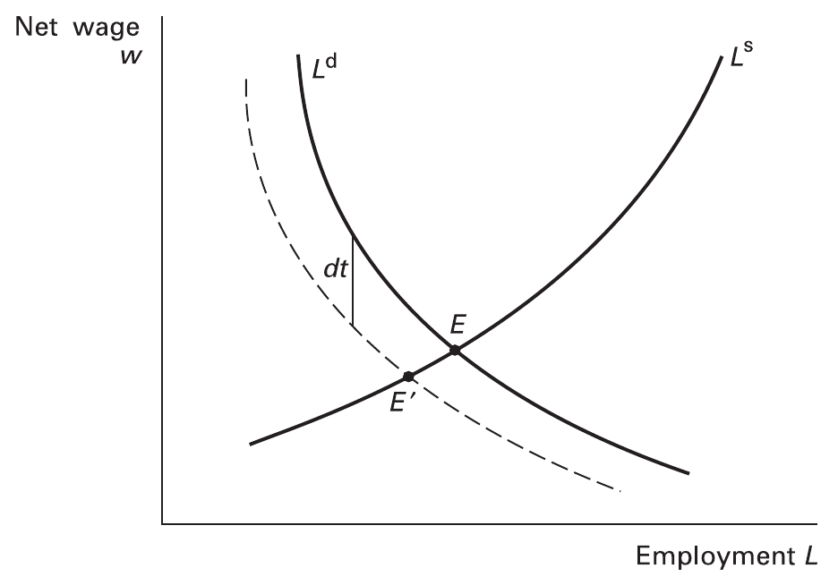
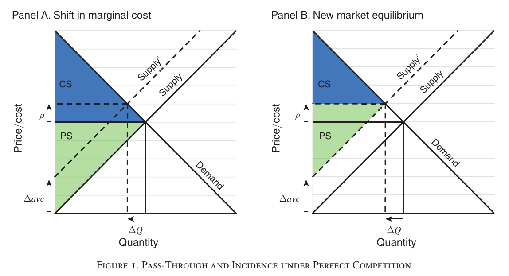

class: inverse, middle, center

```{r, load_refs, include=FALSE, cache=FALSE}
library(RefManageR)
BibOptions(check.entries = FALSE,
           bib.style = "alphabetic",
           cite.style = "alphabetic",
           style = "markdown",
           hyperlink = FALSE,
           dashed = FALSE)
myBib <- ReadBib("./eae6060_bib.bib", check = FALSE)
```

# Tax incidence

---
class: middle
## Tax incidence

> In the economic world an economic action, an institution, a law, do not generate only one effect but a whole series of effects. Only the first effect is obvious. It is manifested simultaneously with its cause: *it can be seen*. 

> The others only unroll in succession. *They cannot be seen*: we are lucky if we can predict them. Here is the whole difference between a good and a bad economist: the
latter only minds the visible effect, while the former accounts for both the effect that can be seen and those that must be predicted...

Frédéric Bastiat, 1850

---
class: middle
## Tax incidence

Economic incidence differs from statutory tax incidence: price changes mean that the market redistributes the tax burden from the statutory payer to other economic agents

Important to take into account general equilibrium effects: **general equilibrium incidence** takes into account factor markets and other goods

Partial equilibrium incidence is more intuitive and easier to estimate: in general, GE incidence requires structural estimation of full GE models

---
class: middle
## Tax incidence in partial equilibrium

Imagine a tax $t$ over wages $w$ (a payroll tax), such that net wages remain $w$ and gross wages become $W \equiv w(1 + t)$.

In **competitive equilibrium**, labor supply equals labor demand: $$L_{D}(w) = L_{S} (w)$$

After introduction of a marginal tax $dt > 0$: $$L_{D} \left( w(1 + dt) \right) = L_{S} (w)$$

---
class: middle
```{r, echo=FALSE, out.width = '70%'}

```

Competitive partial equilibrium after the introduction of a tax wedge $dt>0$ `r Citep(myBib, "salanie2011economics")`

---
class: middle
## Tax incidence in partial equilibrium

The labor supply elasticity is defined as $\epsilon_{S} = w L_{S}^{\prime}/L$ and the labor demand elasticity as $\epsilon_{D} = w L_{D}^{\prime}/L$ 

If we differentiate the entire equation on $t$ and evaluate it at no inital taxes $dt=0$:

$$\frac{d}{dt} L_{D} \left(w(1 + dt)\right) = \frac{d}{dt} L_{S} (w)$$

$$\left. \Rightarrow L_{D}^{\prime}(W) \left( \frac{dw}{dt}(1 + dt) + w \right) \right|_{dt=0} = L_{S}^{\prime} (w) \frac{dw}{dt}$$

---
class: middle
## Tax incidence in partial equilibrium

Multiplying both sides by $w/L$, we have:

$$\Rightarrow \frac{L_{D}^{\prime}(W) w}{L} \left( w + \frac{dw}{dt}\right) = \frac{L_{S}^{\prime} (w) w}{L} \frac{dw}{dt}$$

$$\Rightarrow \epsilon_D w = \frac{dw}{dt} (\epsilon_S - \epsilon_D) \Rightarrow \frac{dw}{dt} \frac{1}{w} = \frac{\epsilon_D}{\epsilon_S - \epsilon_D} $$

Since $\partial \log w / \partial t = dw/wdt$, we conclude that the proportional effect of a tax on net wages is (remembering that $\epsilon_D \leq 0$):

$$\therefore \frac{\partial \log w}{\partial t} =  \frac{\epsilon_{D}}{(\epsilon_{S} - \epsilon_{D})} \in [-1, 0]$$
---
class: middle
## Tax incidence in partial equilibrium

The main result in *partial* equilibrium tax incidence is clear from the equation above: **incidence falls on the most inelastic side of the market**

In extreme cases, when $\epsilon_D = -\infty$ and/or $\epsilon_S = 0$, the tax incidence is all on the supplier (here the worker, since net wages fall the amount of the tax)

Analogously, when $\epsilon_D = 0$ and/or $\epsilon_S = \infty$, incidence is completely on the demand side (here the firm)

---
class: middle
## Pass-through

Since $W = w(1+t)$, the proportional effect of a tax on gross wages (evaluated at $t=0$) is $\partial \log W / \partial t = 1 + \partial \log w / \partial t$, and so:

$$\frac{\partial \log W}{\partial t} =  \frac{\epsilon_{S}}{(\epsilon_{S} - \epsilon_{D})} \in [0, 1]$$

This proportional effect of taxes on posted (gross) prices is called **pass-through rate**, and it is a central statistic in incidence analysis

As we've just shown, *in competitive markets*, tax pass-through rates are always between zero and one

---
class: middle
## Pass-through in non-competitive markets

In non-competitive markets, however, pass-through rates are **not** necessarily always less than one

To see this, consider a monopolist operating with fixed marginal costs in a market with price elasticity of demand decreasing in the price

The monopolist solves: $P/(1+t) \cdot D(P) - c \cdot D(P)$, generating the following **mark-up equation**: $$\frac{P}{1+t} = \frac{c}{1 + \frac{1}{\epsilon_{D}(P)}}$$

---
class: middle
## Pass-through in non-competitive markets

Using the *implicit function theorem*, the **pass-through rate** then is:

$$\frac{d \log P}{dt} = \frac{dP}{dt} \frac{1}{P} = -\frac{\partial _tF}{\partial_p F} \frac{1}{P}$$
$$= - \frac{1}{P} \frac{-P/(1+t)^2}{\frac{1}{1+t} - \frac{c}{1 + \frac{1}{\epsilon_{D}(P)^{2}}} \cdot \frac{-1}{\epsilon_D(P)^{2}} \epsilon_D^{\prime} (P)}$$

$$ = \frac{1}{1 + t - K \cdot \epsilon_D^{\prime} (P)} > 1 \text{ se } \epsilon_D^{\prime} (P) < 0 \text{ e } t \approx 0$$

That is, pass-through is *larger* than one. However, if elasticity is constant, then pass-through is lower than on perfectly competitive markets (which would be one, as supply is infinitely elastic)

---
class: middle
## Tax incidence in theory and practice

Theory can help us understand what determines tax incidence, but in the end it is an **empirical question**: it depends on empirically estimable elasticities

It *does* give us some concrete predictions: (i) incidence of tax increases and decreases should be symmetric; (ii) statutory incidence should not matter; (iii) in competitive markets pass-through is always at most one

But to understand who suffers the tax in a given market we need to estimate the relevant elasticities &mdash; which are **sufficient statistics** for incidence analysis

---
class: middle
## Tax incidence in theory and practice

In practice, a good *rule-of-thumb* is that sales taxes have incidence fully on the consumer: this is because in most markets, in the long run there are near constant returns to scale

We will see in the empirical papers that this rule-of-thumb is not far from the truth, but there are *caveats*

Also, this being a long-run intuition, it opens opportunity for large short-run deviations (and policy evaluation usually measure short-run effects)


---
class: middle
## Empirical estimation of tax incidence

We will now see three different approaches for estimating tax incidence:

1. `r Citep(myBib, "harding2012heterogeneous")` considers how the possibility of geographic tax avoidance affects tax incidence
2. Then in `r Citep(myBib, "benzarti2019really")` we will see how economists try to capture empirically general equilibrium effects
3. Finally, `r Citep(myBib, "ganapati2020energy")` estimates empirically the tax incidence in non-competitive markets using `r Citep(myBib, "weyl2013pass")`

---
class: inverse, middle, center

# Harding et al (2012). "The heterogeneous geographic and socioeconomic incidence of cigarette taxes: evidence from Nielsen Homescan Data"

---
class: middle
## Cigarette taxes

`r Citep(myBib, "harding2012heterogeneous")` estimate tax incidence in the cigarette market: this market is important because almost all economies heavily tax cigarettes

This taxation is what economists call "sin taxes" &mdash; we will talk about these later in the course

Since they are heavily taxed and demand is inelastic, cigarette taxes end up representing a significant share of taxation in current economies, so understanding them is important

---
class: middle
## Geographic incidence

As mentioned, demand for cigarettes is quite *inelastic* (previous studies find $\epsilon_D \approx -0.4$), but if the tax is local (here set at the state level), then price elasticity of demand might be higher

This is because of geographic **tax avoidance**: when taxes in adjacent states are lower, consumers buy cigarettes there, avoiding the higher taxes at home

The authors identify this effect by comparing consumers closer and farther to the state border, as well as those living near borders to states with lower taxes versus near borders to states with similar tax rates

---
class: middle
## Quality upgrade

They use the Nielsen Homescan Data, an American database that pays consumers to scan the barcode of products they buy (as opposed to most studies that use data aggregated at product category)

This allows them to also control for **quality upgrade**: the fact that people tend to move up to better quality products when taxes are higher, which bias upwards estimates of consumer incidence

This is specially true for the USA, since cigarettes are *excise taxes*, charging a fixed amount (not a proportion of price)

---
class: middle
## Summary

`r Citep(myBib, "harding2012heterogeneous")` estimate a tax **pass-through rate** of 85%, smaller than (but not too far from) the 100% rule-of-thumb &mdash; *quality upgrade* is important: not accounting for it, the estimate (biased upwards) is 100%, the same as previous research

But their main point is that consumers being able to buy in other states (a form of tax avoidance) highens their effective elasticity of demand: at the state border, pass-through is only 49%

Socioeconomic characteristics also matter: pass-through is higher in higher-income markets (supposedly lower price elasticity of demand)


---
class: middle
## Empirical strategy

Empirical strategy is a fixed-effects regression ("DiD") of gross price on taxes, with time, state and product fixed-effects

$$P_{uijt} = \beta_0 + \beta_1 \tau_{jt} + \theta X_i + \delta_j + \psi_t + \alpha_u + \epsilon_{uijt}$$

(Note that the regression is in levels because this is an excise tax.) What is the **identifying assumption**?

--

That increases in cigarette taxation are uncorrelated with non-observables that change in time and state and affect prices &mdash; most intuitive example is if states raise taxes when cigarette demand is growing

---
class: middle
```{r, echo=FALSE, out.width = '75%'}

```

Because of state-fixed effects absorbing levels, identification comes from changes in taxes &mdash; the graph shows that *pre-treatment* trends are parallel, which corroborate the **assumption** that *contrafactual* trends are parallel

---
class: middle
```{r, echo=FALSE, out.width = '100%'}


```

Pass-through is estimated as around 1 in the more "naive" specifications, but falls to 84.5% when controlling for product fixed-effecs (which absorbs *quality upgrade*) &mdash; 1¢ of taxes leads to 0.11¢ of quality upgrade

---
class: middle
## Geographic incidence

To investigate geographic incidence, they add distance to border $D_{ijt}$ and interact it with tax difference among states $(\tau^h - \tau^b )_{jt}$

$$P_{uijt} = \beta_0 + \beta_1 \tau_{jt}^h + \beta_2 (\tau^h - \tau^b )_{jt} + \beta_3 \ln D_{ijt} +$$

$$\beta_4 (\tau^h - \tau^b )_{jt} \cdot \ln D_{ijt} + \theta X_i + \delta_j + \psi_t + \alpha_u + \epsilon_{uijt}$$
What is the **identifying assumption?** What are the *partial effects* of a rise in home state taxes $\tau^h$?

--

For example, that stores do not relocate following tax hikes. Partial effects are:

$$\frac{\partial P}{\partial \tau^{h}} = \beta_1 + \beta_2 + \beta_4 \cdot \ln D_{ijt}$$


---
class: middle
```{r, echo=FALSE, out.width = '70%'}

```

Non-parametric regression of pass-through on distance to state border to another state with lower taxation: very close to the border the price elasticity of demand is much higher and so tax incidence falls more on producers 

---
class: middle
```{r, echo=FALSE, out.width = '100%'}

```

Marginal effect is $\beta_1 + \beta_2 + \beta_4 \cdot \ln D$: at the border, pass-through then is only $0.856 - 0.362 = 0.494$!, and it increases by 7.6p.p. for each doubling of distance

---
class: middle
```{r, echo=FALSE, out.width = '70%'}

```

A (FE) regression of log taxes on demand and divided by $q$ identifies the *price elasticity of demand* &mdash; (1) is the *intensive margin*, (2) the *extensive margin*, and (3) the total elasticity

???

However, if there were no tax difference, the elasticities would only be a function of the log excise tax coefficient, and this leads to much larger elasticities in absolute value. For the full margin that includes nonpurchasers, the elasticity with no tax difference is −0.37, which is very close to the “full price elasticity” estimate in Lovenheim (2008) and to the “consensus” elasticity estimate of −0.4 reported by Chaloupka and Warner (2000) in their review article. The estimates in Table 6 are consistent with lower-tax borders having a sizable effect on purchasing behavior, despite the fact that the tax incidence on consumers is smaller close to these borders.

---
class:middle
## Price elasticity of demand

Close to borders, tax hikes have almost no effect on consumer demand, because consumers avoid these taxes by buying in neighboring states

When we set $\tau^h - \tau^b = 0$ (thus we only consider $\beta_1$ in the partial effects equation), which would be the case for a national tax, the elasticity is higher and closer to the literature

So the possibility of cross-border shopping reduces tax incidence on the consumer, but it also limits the government's ability to reduce cigarette consumption: sin taxes should be national

---
class: inverse, middle, center

# Benzarti & Carloni (2019). "Who really benefits from consumption tax cuts? Evidence from a large VAT reform in France"

---
class: middle
## Benzarti & Carloni (2019)

`r Citep(myBib, "benzarti2019really")` analyze the incidence of a VAT for food consumption in restaurants in France &mdash; their contribution is to analyze incidence not only between producers and consumers, but also between profits, wages and input prices

The paper shows the importance of analyzing *general equilibrium incidence* to understand the distributive effects of policy changes

They find (relatively) low incidence on consumers (should be high! Evidence of **asymmetric incidence**) &mdash; incidence mostly on profits, but also some effects on wages and input prices

---
class: middle
## Empirical strategy

July 2009, French government reduced (only) restaurants dine-in VAT taxes from 19.6% to 5.5% (**treatment**), while keeping other small firms' and other service firms' taxes unchanged (**control**)

**Differences-in-differences**: compare treated firms (restaurants) with untreated firms (control) *[first difference]*, before and after the policy change *[second difference]*

This is a *reduced-form regression*: to calculate incidence, we need to insert these estimates into an economic model

---
class: middle
## Problems with empirical strategy

Although they have firm-level data on profits, revenue, etc., they do not have it on price &mdash; price effects are estimated at the aggregate level (by sector of activity)

They also do not observe quantity nor quality of products sold, which can matter (as we saw in previous paper)

They find that in 4 years after the change, capitalists received 55.7% of the tax benefit, workers 18.6%, 12.1% is **shifted backward** downstream and only 13.6% **shifted forward** to consumers

---
class: middle

```{r, echo=FALSE, out.width = '80%'}

```

---
class: middle
## Two-way fixed effects (TWFE)

A more general way of estimating a DiD regression is estimating only the "Treated $\times$ After" interaction and controlling for time and individual fixed-effects (errors are clustered by *département* $d$)

$$\log Y_{idt} = \eta \cdot 1 \{ i \in T \} \cdot \text{After} + \lambda_t + \omega_i + \epsilon_{idt}$$


To calculate dynamic effects by year we just need to change the above for a series of "Year $\times$ Treated" interactions (we need to leave one out so it is not collinear:  $\eta_{0} \equiv 0$)

$$\log Y_{idt} = \sum_{\nu = - k}^{q} \eta_{\nu} \cdot 1 \{ i \in T \} \cdot 1 \{t = \nu \} + \lambda_t + \omega_i + \epsilon_{idt}$$

---
class: middle

```{r, echo=FALSE, out.width = '80%'}

```

---
class: middle

```{r, echo=FALSE, out.width = '80%'}

```


---
class: middle

```{r, echo=FALSE, out.width = '60%'}

```

---
class: middle

```{r, echo=FALSE, out.width = '70%'}

```

When supply is infinitely elastic (horizontal), the surplus gain of producers is zero (full pass-through) and the surplus gain of consumers is $A + C$, where $- A + D$ is the loss of government revenue and $C + D$ the reduction in excess burden

---
class: middle

```{r, echo=FALSE, out.width = '70%'}

```

With inelastic supply, now the incidence is shared between consumers and producers, because the price lowers by less than the tax relief $p_0 + \Delta \tau$

---
class: middle
## First-order and second-order effects

We can approximate the tax incidence by considering only first-order effects ("squares") and ignoring second-order ones ("triangles") &mdash; this makes the math much easier

If we do so, then in the first graph the welfare effect on consumers is just the government revenue loss $A$, and in the second one the revenue loss times *pass-through rate* $A \times \rho$ (And therefore producers get $A \times (1 - \rho)$)

Since the revenue loss is easy to calculate, a **sufficient statistic** for incidence (forward shifting) in competitive markets is the *pass-through rate*

---
class: middle
## Incidence on factors of production

To calculate incidence on factors of production, they note that incidence on producers $1 - \rho$ can be divided by its effect on profits $r_x$, wages $w_x$ and input costs $c_x$, all weighted by their shares in the production function

Putting it all together, the incidence equation becomes:

$$\Omega^{-1} \left[ d \ln p_x - \gamma d \ln w_x - (1 - \delta - \gamma ) d \ln r_x - \delta d \ln c_x \right] = 1,$$ 

Which we can calibrate with our (already shown) quasi-experimental estimates of changes in prices, wages, profit and material costs

---
class: middle

```{r, echo=FALSE, out.width = '70%'}

```

In column (1) we have quasi-experimental estimates of the causal impact of VAT change on prices and factors of production, and in column (2) they are weighted by their shares in production function, as per the equation 

---
class: inverse, middle, center

# Ganapati et al (2020). "Energy Cost Pass-Through in US Manufacturing: Estimates and Implications for Carbon Taxes"

---
class: middle
## Energy cost pass-through

`r Citep(myBib, "ganapati2020energy")` uses public finance methods to study the pass-through effect of energy cost increases &mdash; for us, it is interesting because the same tools can be used to analyze intermediary goods taxation

If we tax oil or energy, how does that affect prices in energy-intensive sectors? The answer depends on market concentration

They adapt new methods for calculating incidence from Weyl and Fabinger (2013) to estimate incidence of energy price increases

---
class: middle
## Estimation strategy

Estimation follows three steps:

1. Expand on `r Citep(myBib, "weyl2013pass")` to establish incidence of taxes *on inputs* as a function of **sufficient statistics** like pass-through and marginal cost changes
2. Estimate firm marginal cost using IO techniques
3. Use energy price shocks as instruments in a shift-share method to estimate the pass-through of marginal costs to prices

---
class: middle
## Incidence of taxes on intermediary goods

The difference between taxation on inputs and taxation on sales is that inputs *can be substituted away from*

As we saw in previous lecture, this is the core reason why we should never tax inputs: they distort production *and* consumption

Therefore the effect of this tax on marginal costs is not obvious (equals 1), but rather needs to be estimated: now we have two *sufficient statistics*, pass-through and cost-shift rate 

---
class: middle
## Perfect competition

Let's first analyze perfect competition. Define incidence as the ratio of changes in *agent surplus*:

$$I \equiv \frac{dCS / d\tau}{dPS / d \tau} \in (0, \infty)$$

If $\rho$ is the *pass-through*, $\rho \equiv dP/d\tau$, and $\gamma$ is the *cost-shift rate* $\gamma \equiv dMC/d\tau$ and for simplicity assuming that $AVC = MC$, we get: 

$$\frac{dCS}{d\tau} = - \rho Q$$

---
class: middle
## Perfect competition

On the producer side, since $PC = \Pi = \left(P - AVC\right)\cdot Q$, using the **envelope theorem** (that is, $dQ/d\tau = 0$) we have that:

$$\frac{dPS}{d\tau} = \left( \frac{dP}{d\tau} - \frac{dAVC}{d \tau} \right)\cdot Q = (\rho - \gamma) Q < 0$$

Therefore the *cost-shift rate* $\gamma$ and *pass-through* $\rho$ are **sufficient statistics** for incidence (multiplying by $-1$): $$I^{\text{PC}} = \frac{\rho}{\gamma - \rho}$$

---
class: middle

```{r, echo=FALSE, out.width = '90%'}

```

A shift in the supply curve (as a tax on inputs) lowers the consumer surplus *on first-order* by the change in prices times quantity and producer surplus by the change in AVC $\times$ quantity minus the lost consumer surplus they now capture

---
class: middle
## Incidence of taxes on intermediary goods

The difference from what we have seen before (sales taxes) is that without the possibility of substituting away from inputs, the cost-shift rate $\gamma = 1$. Then we have that incidence as defined is $I = \rho/(1 - \rho)$, that is, pass-through rate is a sufficient statistic, as we've seen

Consider now non-competitive markets. Once again consumer surplus changes by $-\rho Q$. The main difference is that now firms are *price-setters*, solving:

$$\pi = (P - MC) Q_i$$

---
class: middle
## Non-competitive markets

Product-rule of differentiation gives us:

$$\frac{d \Pi}{d \tau} = Q_i \left( \frac{dP}{d \tau} - \frac{d MC}{d \tau} \right) + \left(P - MC\right) \frac{dQ_i}{d\tau}$$

Multiplying and dividing the second term by $P/Q_i$: $$= Q_i (\rho - \gamma) + Q_i \frac{(P - MC)}{P} \frac{dQ_i P}{d P Q_i} \frac{dP}{d\tau} = Q_i (\rho - \gamma - L \epsilon_{D} \rho ),$$

where the (absolute value) demand elasticity is: $\epsilon_{D} \equiv - \frac{dQ_i P}{d P Q_i}$


---
class: middle
## Non-competitive markets

Hence the relative incidence of input taxation on non-competitive markets is given by (again multiplying by $-1$): $$I = \frac{\rho}{\gamma - (1 - L \epsilon_{D})\rho},$$

where $L \equiv (P - MC)/P$ is the **Lerner Index** of market concentration

In perfect competition, $P = MC$ and therefore $L = 0$ and we again have $I^{PC} = \rho/(\gamma - \rho)$. In a monopoly, we have $I^{M} = \rho/\gamma$, since the usual *mark-up equation* gives:

$$P = \frac{MC}{1 - 1/\epsilon_{D}} \Rightarrow L = 1/\epsilon_{D}$$

---
class: middle

```{r, echo=FALSE, out.width = '90%'}

```

In a monopoly, consumers lose the same, but now producers lose *more*, because the *now first-order* deadweight loss compensates for the absorbed consumer surplus

---
class: middle
## Empirical strategy

To move from theory to empirics, they define the *pass-through of marginal costs to prices* as $\rho_{MC} = dP/dMC = \rho / \gamma$, and the equation above becomes: $$I = \frac{\rho_{MC}}{1 - (1 - L \epsilon_{D})\rho_{MC}}$$

In principle, this sufficient statistic $\rho_{MC}$ could be estimated simply by a regression of prices on marginal costs &mdash; in practice, many non-observables affect price and are correlated with marginal costs, such as quality: it is **endogenous**

To identify the correct parameter they employ a **shift-share instrumental variables** procedure: interacting the (pre-determined) *share* of energy use by region with temporary shocks on energy prices (*shift*)

---
class: middle
## Shift-share IV

The *share* part of the instrument generates cross-section variation and the *shift* part generates time-series variation, allowing them to control for individual and time fixed-effects: $$\log Y_{ist} =  \beta \log Z_{nst} + \gamma X_{nst} + \eta_i + \pi_t + \nu_{ist}$$

$$\log P_{ist} = \rho_{MC, \epsilon} \log MC_{it} + \gamma X_{nst} + \eta_i + \pi_t + \varepsilon_{ist}$$

Where $Y_{ist}$ is the outcome (prices, marginal costs and mark-up), $Z_{nst}$ is the shift-share instruments, $X_{nst}$ are control variables, $i$ is the production plant, $t$ the time, $s$ state and $n$ the industry


---
class: middle

```{r, echo=FALSE, out.width = '70%'}

```

Identification in a shift-share (Bartik) design depends on exogeneity of shares with relation to aggregate-level energy *shocks* (trends; certainly not levels!), similarly to a DiD `r Citep(myBib, "goldsmith2020bartik")` &mdash; or that shocks (*shifts*) are exogenous, as in `r Citep(myBib, "borusyak2022quasi")` and `r Citep(myBib, "adao2019shift")`

---
class: middle

```{r, echo=FALSE, out.width = '80%'}

```

There is some time-series variation on prices of different energy sources, which allows us to compare within each period different regions based on their (previously defined) energy source

---
class: middle
## Estimating elasticity of demand

To estimate the price-elasticity of demand, `r Citep(myBib, "ganapati2020energy")` use industry-level time series of prices and quantities (from NBER-CES) &mdash; but naturally these regressions are endogenous, because supply and demand are codetermined

$$\Delta \log Q_t = - \epsilon_D \Delta \log P_t + \alpha_y t + \alpha_c + \eta_t$$

They instrument for prices $P_t$ using a total factor productivity index, which causes (hopefully) exogenous shifts in the supply curve, allowing us to identify the demand parameters


---
class: middle
## Estimating marginal costs

To estimate the Lerner Index, they need to estimate marginal costs, which are not directly observable in the data (prices are)

They do so by using the fact that firms $P/MC$ equals output elasticity of an input variable divided by its expenditure as a share of revenue &mdash; in non-competitive markets, a (profit-maximizing) rise in input use must generate disproportionate increase in revenues

These output elasticities they estimate using a control function procedure based on `r Citep(myBib, "levinsohn2003estimating")`

---
class: middle

```{r, echo=FALSE, out.width = '80%'}

```

---
class: middle

```{r, echo=FALSE, out.width = '80%'}

```

---
class: middle

```{r, echo=FALSE, out.width = '80%'}

```

Pass-through rates of marginal costs into prices $\rho_{MC}$ vary a lot by industries, from essentially full forward shifting in box industries, to about $33\%$ in gasoline

---
class: middle

```{r, echo=FALSE, out.width = '80%'}
knitr::include_graphics("figs/aula-2-grafico-17.png")
```

In perfect competition, the consumer's share of burden $I/(I+1)$ is given by $\rho_{MC}$, which generates unreasonably high incidence. Clearly, however, $L > 0$, and in many cases close to $1/\epsilon_D$: using the generalized formula gives us much more reasonable estimates of incidence

---
class:middle
# Referências
<small>
```{r refs, echo=FALSE, results="asis"}
PrintBibliography(myBib, start=1, end=5)
```
</small>

---
class:middle
# Referências
<small>
```{r refs2, echo=FALSE, results="asis"}
PrintBibliography(myBib, start=6)
```
</small>

