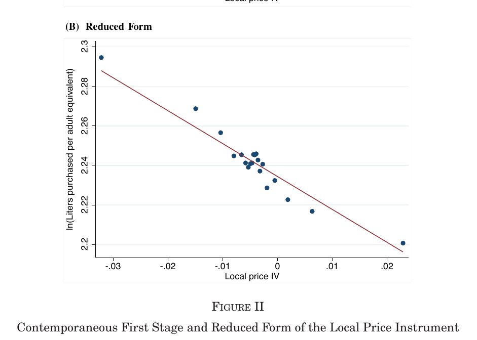

class: inverse, middle, center

```{r, load_refs, include=FALSE, cache=FALSE}
library(RefManageR)
BibOptions(check.entries = FALSE,
           bib.style = "alphabetic",
           cite.style = "alphabetic",
           style = "markdown",
           hyperlink = FALSE,
           dashed = FALSE)
myBib <- ReadBib("./eae6060_bib.bib", check = FALSE)
```

# Optimal indirect taxation

---
class: middle
## Fórmula da elasticidade inversa

Antes de entrar no modelo de taxação ótima, vamos comentar um resultado frequentemente evocado

Vimos no tópico 3 que o peso morto de um imposto em um bem $k$ é $$D_k (t_k ) = \frac{\epsilon^k_D \epsilon_S^k}{\epsilon_D^k + \epsilon_S^k} t_k^2 \frac{p_k x_k}{2}$$

Então *considerando apenas equilíbrio parcial*, podemos pensar num planejador minimizando o peso morto total $D(t) = \sum_k D_k (t_k)$ sujeito a $R(t) = \sum_k t_k p_k x_k = \bar{R}$

Nesse caso, se supormos que o budget share $p_k x_k / Y$ é fixo, temos que: $$t_k \frac{\epsilon_D^k \epsilon_S^k}{\epsilon_D^k + \epsilon_S^k} = \lambda \Rightarrow t_k^* = \lambda \left( \frac{1}{\epsilon_D^k} + \frac{1}{\epsilon_S^k} \right)$$

Essa é a famosa "fórmula da elasticidade inversa" para taxação indireta ótima

---
class: middle
## Fórmula da elasticidade inversa (II)

A fórmula é um pouco "surpreendente", pois indica que a taxação indireta (quase) nunca deveria ser uniforme (ao contrário do que geralmente se vê pelo mundo)

Tem uma intuição clara: quanto menor as elasticidades, menor vai ser a distorção em quantidade pelo imposto: no limite, quando inelásticas, não há distorção, e o imposto é "de graça"

Mas é derivada sob hipóteses muito fortes: em equilíbrio parcial e com análise de peso morto separadamente, o que só é coerente com zero elasticidades cruzadas, sem efeitos de EG ou efeito renda

---
class: middle
## Modelo de taxação indireta ótima

Modelo original vem do gênio Ramsay em 1927 (!), redescoberta pelo Boiteux (1956) e extendida por Diamond-Mirrlees (1971)

Esses modelos supõem que o governo apenas pode taxar renda de forma linear, que podemos desconsiderar pois taxação de renda é igual a uma taxação uniforme no consumo (considere então SPG esse imposto zero)

A derivação está no Salanié, e é importante, mas vamos apresentar só o resultado final

---
class: middle
## Fórmula de Ramsey/Diamond

Considere uma economia com produção que utiliza apenas trabalho e de forma linear

Seja $b_i$ a utilidade marginal **social** líquida do indivíduo $i$, que leva em conta:

1. tanto o efeito direto de transferir recursos para $i$ (o seu peso social dividido pelo custo sombra dos recursos públicos)
2. como o efeito indireto de maior arrecadação pelo maior consumo de $i$

E seja $$\theta_k = \text{cov} \left( \frac{b_i}{\bar{b}}, \frac{IX_k^i}{X_k} \right)$$

a covariância entre o peso social líquido do indivíduo e o seu consumo do bem $k$ (em relação à média)

---
class: middle
## Fórmula de Ramsey/Diamond (II)

Então a fórmula de taxação ótima é: $$- \frac{\sum_j t_j \sum_i S^i_{kj}}{\sum_i X_k} = 1 - \bar{b} - \bar{b} \theta_k,$$

onde $S_{kj}^i$ é o termo $kj$ da matriz de Slutsky, isso é, a derivada cruzada compensada 

O lado esquerdo é o **discouragement index** do bem $k$, e mede aproximadamente (menos) a redução percentual compensada do consumo do bem $k$ pela taxação $t_k$

O lado direito varia em $k$ apenas por (e negativamente em) $\theta_k$, ou seja quão importante socialmente são os consumidores do bem $k$: é o **fator distributivo**

---
class: middle
## Complementariedade com trabalho

Com um consumidor representativo, $b_i = b$ e portanto $\theta_k = 0$. Considerando o caso com 2 bens, pode se mostrar que: $$t_1^* = - \frac{1 - b}{D} \frac{X_1 X_2}{q_2} \left( \epsilon_{10} + \epsilon_{11} + \epsilon_{12} \right),$$

onde $D$ é o determinante da matriz de Slutsky e consideramos o lazer o bem 0. Assim: $$t_1^* - t_2^* = - \frac{1 - b}{D} X_1 X_2 \left( \epsilon_{10} - \epsilon_{20} \right)$$

Mostra-se assim que no ótimo o bem mais taxado é aquele mais complementar com o lazer (e menos aquele complementar com o trabalho)!

---
class: middle
## Fórmula da elasticidade inversa (III)

Voltando à equação ótima geral, se assumirmos, além do acima, também que as elasticidades cruzadas são zero, e lembrando que $\epsilon_{kk} = - S_{kk} q_k / X_k$  então: $$\frac{t_k^*}{1 + t_k^*} = \frac{1 - b}{\epsilon_{kk}}$$

Essa é a fórmula do começo, mas com a suposição de retornos constantes, portanto $\epsilon_S = \infty$

Isso foi usado para justificar "sin taxes" sobre tabaco e álcool (vamos estudar isso ainda nesse tópico!)

Notem as suposições extra: agente representativo e sem elasticidades cruzadas!

Sob que condições temos cobrança uniforme? Deaton (1981) mostrou que sse quasi-separabilidade, i.e., $e(u, \mathbf{q}, w) = e^* (u, w, B(u, \mathbf{q}))$

Mas há muitas razões "extra-modelo" para taxação uniforme!

---
class: middle
## Com taxação direta

Agora, se todos os consumidores são iguais, permitindo taxação não linear da renda, na verdade o governo deveria zerar impostos indiretos e taxar de forma lump-sum todos na renda!

Suponha agora que a função de utilidade é fracamente separável, isto é, $U(\mathbf{X}, L, w) = \tilde{U} (h(\mathbf{X}), L, w)$, onde $h$ é um agregador

Atkinson-Stiglitz (1976) mostram que em um modelo de Mirrlees com taxação direta não-linear, nesse caso a taxação ótima é uniforme (por exemplo zero)

---
class: middle
## Com taxação direta (II)

Intuitivamente, no caso anterior, sem a capacidade de redistribuir por imposto de renda, a taxação ótima faz isso. Quando podemos, não precisamos mais dela para esse propósito

Nesse modelo a única fonte de heterogeneidade é a habilidade, e ela só reflete em diferenças na renda, então pelo **targeting principle**, a taxação deve ser sobre a renda

Se há mais de uma heterogeneidade (por exemplo de riqueza) ou se a separabilidade fraca não vale, o resultado deixa de valer

Na prática, também é bom ter impostos indiretos maiores que zero para expandir a base tributária e combater evasão/sonegação

---
class: middle
## Eficiência produtiva

Diamond-Mirrlees (1971) mostraram que a taxação ótima sempre deixa a economia na fronteira de possibilidades de produção

Isso implica que a taxa marginal de substituição técnica entre dois insumos deve ser igual em todos os seus usos produtivos

Essa propriedade só é possível se toda a distorção estiver no consumo: não há taxação não uniforme sobre o processo produtivo, apenas no consumo

A intuição é que qualquer imposto sobre a produção distorce a produção **e** o consumo, então deve ser pior que um que apenas distorce o consumo

Em geral esse é um argumento forte contra a taxação de bens intermediários, e no mundo real de fato sistemas tributários tendem a taxar apenas a produção final

---
class: inverse, middle, center

# Naritomi, J. (2019). “Consumers as Tax Auditors”

---
class: middle
## Evasão fiscal

Como vimos anteriormente, um motivo para termos impostos indiretos é para expandir a base tributária e combater evasão/sonegação

Nesse sentido, o VAT é um dos melhores impostos, porque dá incentivos às firmas de reportar receita de outras firmas na cadeia produtiva (*third-party reporting*)

Mas uma fraqueza do VAT é que esse incentivo não existe no consumidor final

O artigo da Joana examina o Nota Fiscal Paulista, um programa desenhado exatamente para abordar esse gargalo

A NFP recompensa consumidores (com "cash-back" e sorteios) por checar online o pagamento dos impostos pelas suas compras

---
class: middle
## Resultados

Em geral, o programa foi um grande sucesso: vendas reportadas aumentaram 21% em 4 anos. Receita governamental (isso é, arrecadação menos prêmios) aumentou 9,3%

Firmas com uma quantidade de vendas maior tiveram maior efeito

Quando o número de consumidores é grande, isso dificulta a colusão entre consumidores e vendedores para sonegar impostos

Aprendizado: firmas reportam 7% a mais de vendas (3% de receita) ao receber a primeira reclamação

Firmas reportam consumir mais insumos, mas não o suficiente para contrabalancear o aumento das vendas

Consumidores pedem NF mais depois de receber um prêmio

---
class: middle
## Estratégia empírica

Diferenças-em-diferenças: compara mudança em receita reportada entre varejo (tratamento) e atacado (controle), antes e depois do começo do programa

Estima tanto a versão do DD original: $$\log R_{st} = \eta_s + \gamma_t + \beta \text{Treat}_s \cdot \text{Post}_t + u_{st}$$

Como os efeitos dinâmicos: $$\log R_{st} = \eta_s + \gamma_t + \sum_{k=-8}^{8} \beta^k ( \text{Treat}_s \cdot \text{Period}_t^k ) + u_{st}$$

E efeitos heterogêneos: $$\log R_{its} = \eta_i + \gamma \text{Post}_t + \sum_{m=1}^{2} \alpha^m ( d_{ms} \cdot DD_{ts}) + \epsilon_{its}$$

---
class: middle

```{r, echo=FALSE, out.width = '100%'}
knitr::include_graphics("figs/aula-6-grafico-1.png")
knitr::include_graphics("figs/aula-6-grafico-2.png")
```

---
class: middle

```{r, echo=FALSE, out.width = '100%'}

```

---
class: middle

```{r, echo=FALSE, out.width = '100%'}

```

---
class: middle

```{r, echo=FALSE, out.width = '100%'}

```

---
class: middle

```{r, echo=FALSE, out.width = '100%'}

```

---
class: inverse, middle, center

# Alcott, H., Lockwood, B. and D. Taubinsky (2019). “Regressive Sin Taxes with an Application to the Optimal Soda Tax”

---
class: middle
## Sin goods

Outro ponto que tocamos na teoria é a ideia de "sin goods", que queiramos taxar para diminuir seu consumo

Historicamente se focou em externalidades (*imposto de Pigou*), mas recentemente tem se estudado também **internalidades**

Internalidades são desvios da racionalidade (inconsistência intertemporal, vício, falta de informação sobre os riscos, etc.) que fazem indivíduos consumir mais de um bem do que fariam com racionalidade completa

Isso abre espaço para o governo aumentar o bem-estar social dissuadindo os habitantes de consumir tais bens

---
class: middle
## Contribuição

Generaliza Atkinson & Stiglitz (1976) permitindo que preferências sejam correlacionadas com renda

Isso devolve o caráter distributivo da taxação indireta

Adiciona um "termo de correção", que captura como a taxação dissuade comportamento desejável (externalidades ou internalidades)

Qual efeito é mais poderoso depende da elasticidade da demanda: se mais elástica, o efeito corretivo é maior, se mais inelástica, o redistributivo

Motivo redistributivo pode diminuir sin taxes (pois recaem mais nos pobres) ou aumentar (pois internalidades são maiores neles)

---
class: middle

```{r, echo=FALSE, out.width = '100%'}

```

---
class: middle
## Estratégia empírica

Para estimar elasticidade preço da demanda, eles usam como instrumento a decisão de preço ao nível da rede (Walmart, Safeway, etc.), onde o consumidor geralmente compra e do tipo que compra

Essa estratégia usa o fato estilizado que o preço dos bens é muito constante entre lojas da mesma rede

Estimam a elasticidade renda da demanda usando variações na renda dentro de cada county

Para identificar viés de consumo (internalidades), eles usam um survey de 18.000 domicílios na amostra

---
class: middle
## Taxação ótima

Qualquer mudança no sin tax tem três efeitos (de 1a ordem):

1. Efeito direto (mecânico) da taxação na receita governamental. Efeito depende do valor marginal dos fundos públicos, e de quem está pagando essa taxação
2. "Efeito substituição", que gera uma externalidade fiscal, mas com intermalidades/externalidades, também tem o benefício de reduzí-las
3. Taxação pode afetar oferta de trabalho (bem normal vs bem inferior)

O imposto ótimo vai ser da forma: $$t^* = \bar{\gamma} (1 + \sigma ) + e + \frac{1}{d\bar{s}/dt} \text{Cov} \left( g(z), s_{pref}(z) \right),$$


---
class: middle
## Taxação ótima (II)

$$t^* = \bar{\gamma} (1 + \sigma ) + e + \frac{1}{d\bar{s}/dt} \text{Cov} \left( g(z), s_{pref}(z) \right)$$

onde o primeiro termo, $\bar{\gamma} (1 + \sigma ) + e$,  mede o efeito corretivo da taxação, considerando externalidades $e$ e internalidades $\gamma$

Uma diferença entre os dois é que as internalidades são corrigidas pela renda de quem sofre internalidades e suas elasticidades (medido por $\sigma$)

Já o segundo elemento é o fator redistributivo, e depende da correlação entre a preferência por sin taxes de quem tem renda $z$, $s_{pref}(z)$, e seu peso social marginal $g(z)$

E o peso relativo de cada elemento depende de quanto o consumo de sin goods $\bar{s}$ responde à taxação

---
class: middle
## Casos especiais

Sem vontades redistributivas, o imposto ótimo se torna $t^* = \bar{\gamma} + e$, e o imposto é puramente Pigouviano

Se as preferências não são correlacionadas com renda, então se torna $t^* = \bar{\gamma} (1 + \sigma ) + e$

Aqui temos de volta o resultado de Atkinson & Stiglitz (1976): qualquer intuito redistributivo é melhor feito pela taxação de renda. 

Mas aqui preferências redistributivas ainda importam (via $\sigma$), pois as internalidades covariam com a renda

---
class: middle
## Casos especiais (II)

Se não há internalidades e externalidades, a equação ótima se torna: $$\frac{t^*}{p + t^*} = - \frac{\text{Cov} \left( g(z), s_{pref} (z) \right)}{\bar{s} \bar{\zeta^c}}$$ 

Essa é uma versão da *inverse-elasticity rule*, com a diferença que ao invés de taxar bens mais consumidos pelos ricos, como no Salanié, ele taxa os bens que eles preferem

O teorema de Atkinson & Stiglitz se dá quando $s_{pref} (z) \equiv 0$, e daí a taxação ótima vai ser homogênea (e substituível pelo imposto de renda)

---
class: middle
## Variável instrumental

Eles estimam a elasticidade-preço $\zeta$ e elasticidade-renda da demanda $\xi$ pela equação: $$\ln s_{it} = - \zeta \ln p_{it} + \xi \ln z_{ct} + \nu \mathbf{f}_{it} + \omega_t + \mu_{ic} + \epsilon_{it}$$

Onde $i$ é a família, $c$ o condado, e para estimar variações na elasticidade com a renda eles adicionam interações lineares com o tempo

O preço aqui medido é uma média ponderada do preço dos produtos que eles normalmente compram onde normalmente compram

Como preço é endógeno ao consumo, eles instrumentam o preço de $i$ pela média do preço do produto comprado em todas as lojas da mesma marca **fora** do condado $c$ onde $i$ mora 

---
class: middle

```{r, echo=FALSE, out.width = '100%'}

```

---
class: middle

```{r, echo=FALSE, out.width = '100%'}

```

---
class: middle

```{r, echo=FALSE, out.width = '100%'}

```

---
class: middle

```{r, echo=FALSE, out.width = '100%'}

```

---
class: middle

```{r, echo=FALSE, out.width = '100%'}

```


---
class: middle

```{r, echo=FALSE, out.width = '100%'}

```


---
class: middle

```{r, echo=FALSE, out.width = '100%'}

```


---
class: middle

```{r, echo=FALSE, out.width = '100%'}

```


---
class: middle

```{r, echo=FALSE, out.width = '100%'}

```

---
class: middle

```{r, echo=FALSE, out.width = '100%'}

```

---
class: middle

```{r, echo=FALSE, out.width = '80%'}

```

---
class: middle

```{r, echo=FALSE, out.width = '90%'}

```

---
class: middle

```{r, echo=FALSE, out.width = '100%'}

```


---
class: inverse, middle, center

# Chetty, R., Looney, A. and K. Kroft (2009). “Salience and Taxation: Theory and Evidence” 

---
class: middle
## Racionalidade limitada

Até aqui vimos modelos em que os agentes respondem de forma otimizadora à taxação

Esse artigo estuda um tipo de inatenção e erros de otimização: a dificuldade de calcular os impostos quando eles estão "escondidos" do preço

No Brasil o preço de etiqueta sempre inclui os impostos, mas nos EUA é comum que não inclua, e o imposto é adicionado no caixa

Eles mostram que impostos na etiqueta (mais salientes) têm maior efeito sobre a demanda, e mostram um modelo de custo de welfare da taxação com saliência

---
class: middle
## Estratégia empírica

Principal estratégia do artigo é um experimento que eles fazem em uma loja de conveniência, mas eles também mostram dados empíricos sobre o efeito de impostos sobre o álcool

Como o experimento não é aleatório, eles não podem simplesmente comparar médias: eles fazem um diferenças-em-diferenças, comparando com outras lojas parecidas ou com produtos que não participaram do experimento na mesma loja

Eles também fazem um exercício de triplas-diferenças

Finalmente, eles olham para o mercado de álcool, que contém impostos na etiqueta (*excise taxes*) e também só no caixa (*sales taxes*), e compara efeitos de mudanças nos 2 impostos ao longo do tempo

---
class: middle

```{r, echo=FALSE, out.width = '100%'}
knitr::include_graphics("figs/aula-5-grafico-1.png")
```

---
class: middle
## Estratégia empírica (II)

Seja $\epsilon_{p} \equiv - \partial \log x / \partial \log p$ a elasticidade-preço da demanda e a elasticidade-taxação da demanda $\epsilon_{1 + \tau}  \equiv - \partial \log x / \partial \log (1 + \tau)$

Naturalmente no modelo neoclássico $\epsilon_p = \epsilon_{1+\tau}$, mas se o imposto é menos saliente, não precisa ser verdade

Eles estimam então: $$\log x(p, \tau^s ) = \alpha + \beta \log p + \theta_{\tau} \beta \log (1 + \tau),$$

onde o parâmetro de interesse é $\theta_{\tau} = \epsilon_{1+\tau} / \epsilon_p$, que mede quanto os agentes respondem menos à taxação (menos saliente)


---
class: middle
## Estratégia empírica (III)

1a estratégia (experimento): tornando o imposto completamente saliente, temos que: $$\log x \left( (1 + \tau^s )p, 0 \right) - \log x \left( p, \tau^s \right) = (1 - \theta_{\tau}) \beta \log \left( 1 + \tau^s \right)$$ 

$$\Rightarrow (1 - \theta_{\tau}) = - \frac{\log x \left( (1 + \tau^s )p, 0 \right) - \log x \left( p, \tau^s \right)}{\epsilon_{p} \log \left( 1 + \tau^s \right)}$$

2a estratégia (painel): usar variações independentes em $p$ (na verdade em impostos salientes) e $\tau^{s}$ (impostos não salientes) e estimar a equação anterior diretamente

---
class: middle
## Experimento

Não foi experimento aleatório! Gerente não queria perder (muito) dinheiro, e aceitou apenas para 3 grupos de produtos que não fossem líderes de venda

Grupo de tratamento: cosméticos, desodorantes e shampoos/condicionadores

Grupos de controle: (i) outros produtos similares na mesma localidade e loja: pasta de dente, hidratante, etc. (ii) vendas de outras 3 lojas com características similares 

---
class: middle

```{r, echo=FALSE, out.width = '100%'}

```

---
class: middle

```{r, echo=FALSE, out.width = '100%'}

```

---
class: middle

```{r, echo=FALSE, out.width = '100%'}

```

---
class: middle

```{r, echo=FALSE, out.width = '100%'}

```

---
class: middle

```{r, echo=FALSE, out.width = '100%'}

```

---
class: middle
## Experimento (II)

Resultado do DDD é que o experimento diminuiu a demanda em $2.2$ unidades, de uma média de $29$ unidades vendidas no controle, ou seja, $7.6\%$

Dada uma elasticidade-preço da demanda de 1.59, que eles estimam, e o imposto sendo de $7.375\%$, nosso estimador é $$\theta_{\tau} = 1 - \left( \frac{7.6}{(1.59 \times 7.375)} \right) = 0.35$$

Ou seja, um aumento de imposto de $10\%$ tem o mesmo efeito apenas que um aumento nos preços de $3.5\%$!

---
class: middle
## Dados observacionais

Comparar o efeito de mudanças em *excise taxes*, que são incluídas no preço (e portanto tem o mesmo efeito de mudanças no preço) e *sales taxes*, que são cobradas no caixa (menos saliente)

Estimam a equação estrutural em primeiras diferenças por causa de autocorrelação: $$\Delta \log x_{jt} = \alpha^{\prime} + \beta \Delta \log (1 + \tau^E_{jt}) + \theta_{\tau} \beta \Delta \log (1 + \tau^S_{jt}) + X_{jt}\rho + \epsilon_{jt}$$

Estimam por OLS e testam se $\theta_{\tau} = 1$

--

**Suposição de identificação:** Mudanças nos impostos (sales e excise taxes) não são correlacionadas com choques específicos de estados no consumo de álcool

---
class: middle

```{r, echo=FALSE, out.width = '100%'}

```

---
class: middle

```{r, echo=FALSE, out.width = '100%'}

```

---
class: middle
## Resultados

Na especificação mais simples, eles acham que um aumento de $1\%$ nos impostos excise diminuem a demanda em $0.88\%$, enquanto o mesmo aumento em impostos de sales diminui em apenas $0.2\%$!

Sales taxes parecem estar relacionadas com o ciclo econômico (queda na economia gera déficits que são cobertos aumentando os impostos), e corrigir por isso apenas aumenta a diferença

Usando uma média das elasticidades das diferentes especificações, eles têm que $\epsilon_{p} = 0.84$, $\epsilon_{1+ \tau} = 0.03$, e portanto $\theta_{\tau} = 0.06$

Ou seja, impostos não salientes são basicamente ignorados pelos consumidores


---
class: middle
## Por que isso?

Há duas explicações possíveis: consumidores não entendem os impostos ou não reagem a eles por inatenção (saliência)

Evidência apoia 2a explicação: consumo de produtos perto da intervenção não mudou, e survey mostra que pessoas sabem quais são os impostos

Mas por que tanto erro? Pequenos custos cognitivos podem gerar grandes erros de comportamento, pois seu custo ao consumidor é de 2a ordem!

Por exemplo, se um consumidor gasta `$`1000 em álcool e tem $\epsilon_p = 1$, ele perde apenas `$`5 ignorando um imposto de $10\%$ (teorema do envelope!)


---
class: middle
## Análise de bem-estar

Como a existência de racionalidade limitada afeta a análise de bem-estar?

**Incidência:** da condição de equilíbrio, $D(p, t^s, Z) - S(p) = 0$, o TFI nos dá que o efeito do imposto no preço do produtor é: $$\frac{dp}{dt^{s}} = \frac{\partial D / \partial t^s}{\partial S / \partial p - \partial D / \partial p} = - \frac{\epsilon_{D,t^s}}{\frac{q}{p} \epsilon_{S,p} - \epsilon_{D,p}} = - \frac{\theta \epsilon_{D,p}}{\frac{q}{p} \epsilon_{S,p} - \epsilon_{D,p}}$$

A única diferença desse caso para o tradicional é que a curva de demanda se move por $t^S \partial D / \partial t^S$, e não $t^S \partial D / \partial p$

Com saliência, a curva de demanda se move pela elasticidade do imposto, mas o ajustamento de preço para zerar o mercado se dá pela elasticidade preço

---
class: middle

```{r, echo=FALSE, out.width = '100%'}

```

---
class: middle
## Análise de bem-estar (II)

Incidência nos produtores é atenuada por $\theta$; quando $\theta$ é baixo, a incidência se dá quase toda nos consumidores

Saliência funciona como uma curva de demanda mais inelástica, mas não exatamente: uma demanda mais inelástica diminui o movimento da demanda, mas aumenta o corte de preço para equilibrar o mercado, enquanto a saliência diminui o movimento e não tem nenhum efeito sobre o corte de preço

Outra diferença: com saliência *não há neutralidade da incidência formal*!

---
class: middle

```{r, echo=FALSE, out.width = '100%'}

```

---
class: middle
## Análise de bem-estar (III)

Agora para a **estimação do peso morto**. Suposições: impostos só afetam utilidade pela demanda, e se impostos são salientes a alocação é ótima

Então o peso morto é $$\text{EB}(t^S) \simeq - \frac{1}{2} (t^S)^2 \theta^c \frac{\partial x^c}{\partial t^S} = - \frac{1}{2} (\theta^c t^S)^2 x(p, t^S, Z) \frac{\epsilon^c_p}{p + t^S}$$

O peso morto é zero se $\theta^c = 0$, e quando é maior que zero, $\text{EB}(t^S) \propto \theta^2$

Como o peso morto é quadrático em saliência e linear na elasticidade, seus efeitos são diferentes

Peso morto pode ser positivo mesmo que $\partial x / \partial t^S = 0$ se houver efeito renda, pois o agente acaba consumindo mais do bem do que deveria
